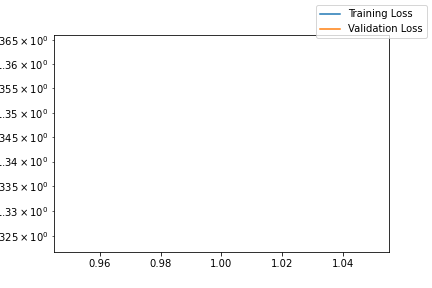

# BassTabAI_v2

This model is a simplified version of the BassTabAI model. In this version, we will use a deepened understanding of Neural Networks to create a NLP that focuses more on the Attention Mechanism (in this case Self-Attention).

## The Architecture

1. **Dataset**
    - **Dataset Preparation**:
        - Dataset starts with webscraping all the data. It then ensures everything is in the right format, such as pull-offs and hammer-ons being denoted by both the lowercase p and h. It then ensures all tabs start in the same way and splits the bars.
    - **Tab Recognition**:
        - The model then tries to recognize the actual tabs from text that surrounds it. It does so by focusing on the first item per line, which should be G, D, A, or E.
    - **Tokenization**:
        - The data is split into tokens, which are just the notes that are played per beat.

        For example:

        ```
        G|---9h11  
        D|-------  
        A|-7-----  
        E|-------
        ```

        Is split into `('GDAE', '||||', '----', '--7-', '----', '9---', 'h---', '1---', '1---')`

        Initially, I thought it would be better to split the data per actual note (so 9 would become 9h and 1 and 1 would be added together to form 11). But for now, this approach seems to work.
    - **Tab Printing**:
        - The file also contains the `print_basstab` function, which takes a list of tokens and then prints them as a tab (the inverse of the previous example).

2. **Training**:
    - Train is used to train the model on the dataset, which has been saved as Dataset.pickle.
    - **Dictionary Generation**:
        - Dictionary is generated, which contains both the encoder and decoder for the data.
    - **Data Preparation**:
        - Data is split into training and validation, as well as different batches.
    - **Loss Estimation**:
        - `estimate_loss` function is used to estimate the loss as an output during training.

4. **Attention Model**:
    - In `AttentionModel` contains the actual model architecture. This one is split into different blocks that are inspired by the GPT framework:
        - **Block Structure**:
            - MultiHeadAttention
            - LayerNorm + Residue
            - FeedForward (with ReLu and Dropout)
            - LayerNorm + Residue
        - **Model Structure**:
            - Token embedding
            - Position embedding (Attention does not remember the position of tokens, so these need to be programmed in)
            - A N amount of Blocks
            - LayerNorm
            - Linear Layer for output
        - **Forward Pass**:
            - The forward of this model is the cross-entropy.

5. **Model.py**:
    - `Model.py` contains the example to output the model.

6. **Hyperparameter Optimization**:
    - `hyperopt_search.py` contains the function that uses hyperopt to research the best hyperparameters, which are stored in a pickle file.

## Training the Model

When training the model with the optimized hyperparameters:

```json
{
    "batch_size": 48,
    "block_size": 52,
    "dropout": 0.09853040756166137,
    "eval_interval": 1000,
    "eval_iters": 200,
    "learning_rate": 0.007617883451530519,
    "max_iters": 1000,
    "n_embd": 85,
    "n_heads": 7,
    "n_layer": 4
}
```

we can see the next loss curve for both training and validation:
Loss Curve



An example of what the code returns now:

runcell(5, 'C:/Users/Mels/Documents/GitHub/BassTab_Transformer/Model.py')
G|---4-4-4-4-4-4-4---4------------|-----6--------------------------------------------
D|-----------------4----2--2------|---4-------4-------------------1------0-----------
A|-2----------------------------2-|-4-----4-----------------2--------12-2--5--10-10-|
E|--------------------------------|---------------2--7--9-|-3-5---1-0---0--70-------|

Things To Do

    Implement MLFlow better
    Clean up files. Add pngs to new map, add datasets somewhere else
    Make the model more complex to generate better tabs
    Make the model faster by implementing C++
    Improve Positional Encoding according to https://machinelearningmastery.com/a-gentle-introduction-to-positional-encoding-in-transformer-models-part-1/
    Use context managers
    Implement functions that check the input and output. Greatly shorten the docstrings

Positional Encoding Example:

```
import torch
import torch.nn as nn
import torch.nn.functional as F

class PositionalEncoding(nn.Module):
    def __init__(self, n_embd, block_size):
        super(PositionalEncoding, self).__init__()
        self.dropout = nn.Dropout(p=0.1)

        pe = torch.zeros(block_size, n_embd)
        position = torch.arange(0, block_size, dtype=torch.float).unsqueeze(1)
        div_term = torch.exp(torch.arange(0, n_embd, 2).float() * (-math.log(10000.0) / n_embd))
        pe[:, 0::2] = torch.sin(position * div_term)
        pe[:, 1::2] = torch.cos(position * div_term)
        pe = pe.unsqueeze(0)
        self.register_buffer('pe', pe)

    def forward(self, x):
        x = x + self.pe[:, :x.size(1)]
        return self.dropout(x)

class Block(nn.Module):
    # Your Block implementation goes here

class AttentionModel(nn.Module):
    def __init__(self, vocab_size, n_layer, n_heads, n_embd, block_size, dropout):
        super().__init__()
        self.token_embedding_table = nn.Embedding(vocab_size, n_embd)
        self.blocks = nn.Sequential(*[Block(n_heads=n_heads, n_embd=n_embd, 
                                            block_size=block_size, dropout=dropout) for _ in range(n_layer)])
        self.ln_f = nn.LayerNorm(n_embd)
        self.lm_head = nn.Linear(n_embd, vocab_size)
        
        self.position_encoder = PositionalEncoding(n_embd, block_size)

    def forward(self, idx, targets=None):
        B, T = idx.shape

        tok_emb = self.token_embedding_table(idx)
        x = self.position_encoder(tok_emb)
        x = self.blocks(x)
        x = self.ln_f(x)
        logits = self.lm_head(x)

        if targets is None:
            loss = None
        else:
            B, T, C = logits.shape
            logits = logits.view(B*T, C)
            targets = targets.view(B*T)
            loss = F.cross_entropy(logits, targets)

        return logits, loss

```
